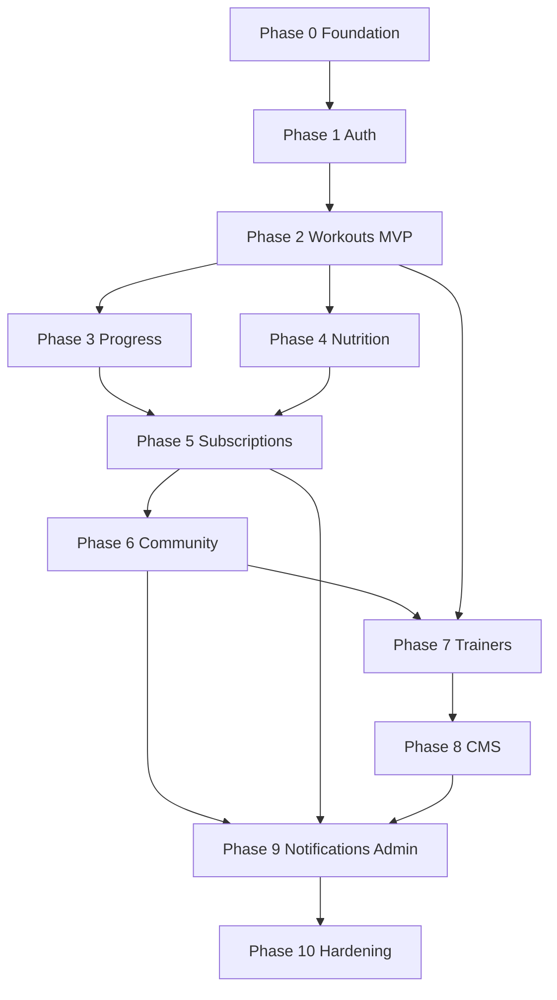

# Roadmap

Implementation phases in **delivery order** for the full FitSprint platform. Each phase is shippable before the next. Scope follows [README.md](../README.md), [mission.md](./mission.md), and [tech-stack.md](./tech-stack.md).

**Strategy:** Ship the **workout + auth + profile** core early (strength-first DNA), then progress and nutrition, then monetization and social surfaces, then trainers/CMS/admin at scale.

---

## Phase 0 — Foundation — ✅ Complete

**Goal:** Production-ready skeleton on Vercel + Supabase.

| Deliverable | Notes |
|-------------|--------|
| Next.js scaffold | App Router, TypeScript, Tailwind, shadcn/ui |
| Supabase project | Migrations pipeline, `profiles` + RLS, env on Vercel |
| App shell | Landing, login, signup, dashboard |
| Auth (early) | Email/password, OAuth, sign out, middleware |
| WCAG baseline | Focus order, landmarks, contrast tokens |
| Quality gates | Local `lint` + `typecheck` + `build` (GitHub Actions CI → Phase 1) |
| Deploy | [docs/deploy.md](../docs/deploy.md) — import repo + env vars |

**Spec:** [2026-05-21-phase-0-foundation](./2026-05-21-phase-0-foundation/) · [Vision alignment](./2026-05-21-phase-0-foundation/vision-alignment.md)

**Exit criteria:** App deploys; `GET /api/health` passes; design system tokens in place. **Met** (deploy via Vercel dashboard/CLI).

---

## Phase 1 — Authentication & user management

**Goal:** Secure access and RBAC foundation per README § Authentication.

| Deliverable | Notes |
|-------------|--------|
| Email/password registration | Supabase Auth |
| Email verification & password reset | Auth flows + transactional email |
| Login / logout | Session via Supabase; middleware protection |
| RBAC skeleton | Roles: `user`, `premium`, `trainer`, `admin` on profile |
| Social OAuth | Google, Apple, Facebook via Supabase Auth; account linking with email users |
| OAuth callback routes | Supabase redirect URLs configured for Vercel (dev + prod) |
| API routes | `POST /api/auth/register`, `login`, `logout`, `reset-password`; OAuth via Supabase client/server flow |

**Exit criteria:** User can sign up or sign in with email/password **or** Google, Apple, or Facebook; session and RBAC work for all methods; email verification applies to password signups.

---

## Phase 2 — Profiles & workout core (MVP)

**Goal:** Solo lifter / registered user can train on-platform—**priority module**.

### 2.1 User profiles

- Profile edit, fitness goals, activity preferences
- BMI helper (calculated fields)
- Units preference (kg/lb) where applicable

### 2.2 Workout management

- Exercise library (built-in + custom)
- Personalized plans / templates
- Session logging (sets, reps, weight, completion)
- Exercise filtering; favorites
- Placeholder or links for exercise instructions/video

### 2.3 Basic dashboard

- Recent workouts, simple weekly/monthly stats

**Deferred to Phase 3:** Advanced charts, PR detection, premium-only analytics depth.

**Exit criteria:** User logs a full workout from template or scratch; history and dashboard reflect it.

---

## Phase 3 — Progress tracking & analytics

**Goal:** README § Progress Tracking + deeper workout insights.

| Deliverable | Notes |
|-------------|--------|
| Weight & body measurements | Time-series storage |
| Progress charts & reports | Volume, trends, milestones |
| Achievement milestones | Badges linked to training data |
| Progress photos | Supabase Storage |
| Workout analytics upgrade | e.g. estimated 1RM, PR highlights, muscle-group volume |

**Exit criteria:** User sees measurement trends and training progress charts over selectable ranges.

---

## Phase 4 — Nutrition tracking

**Goal:** README § Nutrition.

| Deliverable | Notes |
|-------------|--------|
| Meal logging | `/api/nutrition/log` |
| Calorie & macro calculation | Per entry and daily rollup |
| Water intake | Daily tracker |
| Food database search | Integrate chosen data source (see tech-stack open decisions) |
| History & recommendations | `/api/nutrition/history`, recommendations endpoint |

**Exit criteria:** User logs meals and water; daily macros visible on dashboard.

---

## Phase 5 — Subscriptions & premium

**Goal:** README § Subscription System; unlock `premium` role features.

| Deliverable | Notes |
|-------------|--------|
| Free vs premium plans | Feature flags by role |
| Monthly / yearly billing | Stripe or Razorpay |
| Trials & cancellation | Webhooks update subscription state |
| Premium gates | Advanced analytics, personalized plans, premium content stubs |

**Exit criteria:** User upgrades to premium; payment and role update reliably; premium-only route enforced.

---

## Phase 6 — Community

**Goal:** README § Community Features.

| Deliverable | Notes |
|-------------|--------|
| Posts & discussions | CRUD with ownership |
| Likes, comments, replies | Nested or flat comment model |
| User following | Feed or profile-scoped activity |
| Achievement badges (social) | Tie to Phase 3 milestones where overlap |
| Basic moderation | Report flag; admin queue in Phase 9 |

**Exit criteria:** Registered user can post, comment, and follow; content respects RBAC.

---

## Phase 7 — Trainer features

**Goal:** README § Trainer Features.

| Deliverable | Notes |
|-------------|--------|
| Trainer profiles | Public pages, bio, specialties |
| Program publishing | Workout plans exposed to users |
| User inquiries | Messaging or request form |
| Trainer ratings | Post-engagement reviews |

**Exit criteria:** Trainer role user publishes a program; registered user discovers and saves/starts it.

---

## Phase 8 — Blog & CMS

**Goal:** README § Blog & CMS.

| Deliverable | Notes |
|-------------|--------|
| Blog publishing | Admin/trainer-author roles |
| Categories, tags, SEO metadata | Sitemap, Open Graph |
| Embedded video | oEmbed or hosted URLs |
| Public visitor access | SEO landing content |

**Exit criteria:** Editor publishes post; visitors read on public routes with SEO tags.

---

## Phase 9 — Notifications & admin

**Goal:** README § Notifications + Admin Dashboard.

### Notifications

- Email: workout reminders, subscription alerts
- In-app notification preferences
- Dispatch via transactional email provider

### Admin dashboard

- User management
- Subscription oversight
- Content & community moderation
- Platform analytics (signups, MRR, active users)
- Audit log review

**Exit criteria:** Admin moderates a report; user receives reminder email per preferences.

---

## Phase 10 — Data ownership, hardening & NFR sign-off

**Goal:** Mission principle on portability + README acceptance criteria.

| Deliverable | Notes |
|-------------|--------|
| Data export (GDPR) | JSON/CSV for workouts, nutrition, progress |
| Account deletion | Cascade with retention policy |
| Performance pass | Homepage < 3s; API p95 < 500ms on critical paths |
| Security review | OWASP checklist, penetration test as budget allows |
| Accessibility audit | WCAG 2.1 verification |

**Exit criteria:** Stakeholder acceptance criteria in README met for target release.

---

## Phase 11 — Future enhancements (backlog)

Not scheduled; prioritize by feedback after Phase 10:

- Native mobile apps
- AI-powered coaching
- Wearable integrations (Apple Health, Garmin, etc.)
- Live workout streaming
- Voice assistants
- Gamification extensions
- Multilingual support
- Redis / advanced caching if traffic demands

---

## Dependency overview

Phases 3 and 4 may overlap after Phase 2 is stable. **Phase 2 must complete before monetization and community** to avoid an empty social/product surface.

---

## Current focus

**Active phase:** Phase 1 — Authentication & user management (polish) → Phase 2 — Workouts MVP

**Branch:** Merge `feature/phase-0-foundation` when ready; start `feature/phase-1-auth` or continue on main.

**Phase 0 completed:** 2026-05-21 — see [validation](./2026-05-21-phase-0-foundation/validation.md).

**Next milestone checklist (Phase 2 MVP):**

- [x] Auth & sign-in flow (core delivered in Phase 0; RBAC gates remain Phase 1)
- [ ] User profiles & goals
- [ ] Exercise library & workout logging
- [ ] Templates / plans & favorites
- [ ] Basic dashboard

Update this section as phases complete.
