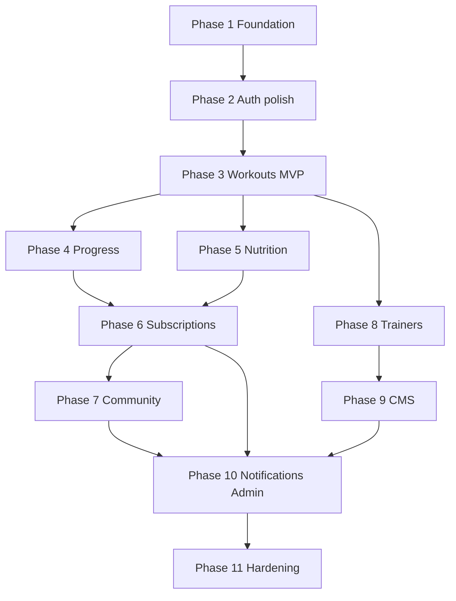

# Roadmap

Implementation phases in **delivery order** for the full FitSprint platform. Each phase is shippable before the next. Scope follows [README.md](../README.md), [mission.md](./mission.md), and [tech-stack.md](./tech-stack.md).

**Numbering:** Phases start at **1** (no Phase 0).

**Strategy:** Ship the **workout + auth + profile** core early (strength-first DNA), then progress and nutrition, then monetization and social surfaces, then trainers/CMS/admin at scale.

---

## Phase 1 — Foundation — ✅ Complete

**Goal:** Production-ready skeleton on Vercel + Supabase, plus **full UI shell** for marketing, member app, and admin (dummy data).

| Deliverable | Notes |
|-------------|--------|
| Next.js scaffold | App Router, TypeScript, Tailwind v4, shadcn/ui |
| Supabase project | `profiles`, admin role, **domain schema** migration, RLS stubs |
| Marketing UI | `/` — hero, stats, features, coaches, stories, BMI, pricing, CTA |
| Auth | Email/password, OAuth, logout, role-aware redirects |
| Member UI shell | `/dashboard/*` — overview, workouts, nutrition, progress, community, pricing, profile, settings |
| Admin UI shell | `/admin/*` — overview, users, subscriptions, trainers, content, reports, settings |
| Charts | `WeeklyActivityChart`, `MacroDonutChart`, `SimpleBarChart` (realistic axes; dummy series) |
| WCAG baseline | Focus order, landmarks, contrast tokens |
| Quality gates | Local `lint` + `typecheck` + `build` (GitHub Actions CI → Phase 2) |
| Deploy | [docs/deploy.md](../docs/deploy.md) |

**Spec:** [2026-05-21-phase-1-foundation](./2026-05-21-phase-1-foundation/) · [Vision alignment](./2026-05-21-phase-1-foundation/vision-alignment.md)

**Exit criteria:** App deploys; health check passes; design tokens; member + admin routes render. **Met.** Domain tables exist; **persistence wiring** is Phase 3+.

---

## Phase 2 — Authentication polish & CI — ✅ Complete

**Goal:** Harden auth flows and add automated quality gates per README § Authentication.

| Deliverable | Notes |
|-------------|--------|
| Email/password registration | ✅ Supabase Auth + `POST /api/auth/register` |
| Email verification & password reset | ✅ `/verify-email`, `/forgot-password`, `/reset-password` |
| Login / logout | ✅ Session + middleware; `POST /api/auth/logout` |
| RBAC enforcement | ✅ `lib/auth/rbac.ts`; premium gate on `/dashboard/progress` |
| Social OAuth | ✅ UI + callback (provider config in Supabase) |
| OAuth callback routes | ✅ `/auth/callback` (confirm + recovery) |
| GitHub Actions CI | ✅ `.github/workflows/ci.yml` |
| API routes | ✅ `register`, `reset-password` |

**Spec:** [2026-05-22-phase-2-auth-ci](./2026-05-22-phase-2-auth-ci/)

**Exit criteria:** Met — verification/reset flows, RBAC gates, CI on PRs.

---

## Phase 3 — Profiles & workout core (MVP) — ✅ Complete

**Goal:** Solo lifter / registered user can train on-platform—**priority module**.

**Spec:** [2026-05-24-phase-3-workouts-mvp](./2026-05-24-phase-3-workouts-mvp/)

### 3.1 User profiles

- Profile edit, fitness goals, activity preferences
- BMI helper (calculated fields)
- Units preference (kg/lb) where applicable

### 3.2 Workout management

- Exercise library (built-in + custom)
- Personalized plans / templates
- Session logging (sets, reps, weight, completion)
- Exercise filtering; favorites
- Placeholder or links for exercise instructions/video

### 3.3 Basic dashboard

- Recent workouts, simple weekly/monthly stats

**Delivered:** Profile/settings save, workout library from DB, session start/complete, live dashboard + progress charts.

**Deferred to Phase 4:** Advanced charts, PR detection, per-set logging, custom exercises.

**Exit criteria:** Met — workouts log to Postgres and dashboard updates.

---

## Phase 4 — Progress tracking & analytics

**Goal:** README § Progress Tracking + deeper workout insights.

| Deliverable | Notes |
|-------------|--------|
| Weight & body measurements | Time-series storage |
| Progress charts & reports | Volume, trends, milestones |
| Achievement milestones | Badges linked to training data |
| Progress photos | Supabase Storage |
| Workout analytics upgrade | e.g. estimated 1RM, PR highlights, muscle-group volume |

**Phase 1 UI (done):** `/dashboard/progress` with metric cards and bar charts (dummy data).

**Exit criteria:** User sees measurement trends and training progress charts over selectable ranges from **persisted** `body_measurements` / `progress_metrics`.

---

## Phase 5 — Nutrition tracking

**Goal:** README § Nutrition.

| Deliverable | Notes |
|-------------|--------|
| Meal logging | `/api/nutrition/log` |
| Calorie & macro calculation | Per entry and daily rollup |
| Water intake | Daily tracker |
| Food database search | Integrate chosen data source (see tech-stack open decisions) |
| History & recommendations | `/api/nutrition/history`, recommendations endpoint |

**Phase 1 UI (done):** `/dashboard/nutrition` — macro donut, meal list, summary cards (dummy data). Tables: `nutrition_meals`, `nutrition_daily_macros`.

**Exit criteria:** User logs meals and water; daily macros visible on dashboard from **live** data.

---

## Phase 6 — Subscriptions & premium

**Goal:** README § Subscription System; unlock `premium` role features.

| Deliverable | Notes |
|-------------|--------|
| Free vs premium plans | Feature flags by role |
| Monthly / yearly billing | Stripe or Razorpay |
| Trials & cancellation | Webhooks update subscription state |
| Premium gates | Advanced analytics, personalized plans, premium content stubs |

**Phase 1 UI (done):** `/dashboard/pricing` + landing pricing section (dummy plans). Tables: `subscription_plans`, `user_subscriptions`.

**Exit criteria:** User upgrades to premium; payment and role update reliably; premium-only route enforced.

---

## Phase 7 — Community

**Goal:** README § Community Features.

| Deliverable | Notes |
|-------------|--------|
| Posts & discussions | CRUD with ownership |
| Likes, comments, replies | Nested or flat comment model |
| User following | Feed or profile-scoped activity |
| Achievement badges (social) | Tie to Phase 4 milestones where overlap |
| Basic moderation | Report flag; admin queue in Phase 10 |

**Phase 1 UI (done):** `/dashboard/community` feed (dummy posts). Tables: `community_posts`, `community_comments`, `community_likes`.

**Exit criteria:** Registered user can post, comment, and follow; content respects RBAC.

---

## Phase 8 — Trainer features

**Goal:** README § Trainer Features.

| Deliverable | Notes |
|-------------|--------|
| Trainer profiles | Public pages, bio, specialties |
| Program publishing | Workout plans exposed to users |
| User inquiries | Messaging or request form |
| Trainer ratings | Post-engagement reviews |

**Exit criteria:** Trainer role user publishes a program; registered user discovers and saves/starts it.

---

## Phase 9 — Blog & CMS

**Goal:** README § Blog & CMS.

| Deliverable | Notes |
|-------------|--------|
| Blog publishing | Admin/trainer-author roles |
| Categories, tags, SEO metadata | Sitemap, Open Graph |
| Embedded video | oEmbed or hosted URLs |
| Public visitor access | SEO landing content |

**Exit criteria:** Editor publishes post; visitors read on public routes with SEO tags.

---

## Phase 10 — Notifications & admin (live workflows)

**Goal:** README § Notifications + Admin Dashboard.

### Notifications

- Email: workout reminders, subscription alerts
- In-app notification preferences
- Dispatch via transactional email provider

### Admin dashboard

- User management
- Subscription oversight
- Content & community moderation
- Platform analytics (signups, MRR, active users)
- Audit log review

**Phase 1 UI (done):** `/admin/*` routes with dummy data (`lib/data/admin-dashboard.ts`). Tables: `content_moderation_flags`, `platform_reports`, `audit_logs`, `cms_content`.

**Exit criteria:** Admin moderates a report; user receives reminder email per preferences — **live** workflows, not static lists.

---

## Phase 11 — Data ownership, hardening & NFR sign-off

**Goal:** Mission principle on portability + README acceptance criteria.

| Deliverable | Notes |
|-------------|--------|
| Data export (GDPR) | JSON/CSV for workouts, nutrition, progress |
| Account deletion | Cascade with retention policy |
| Performance pass | Homepage < 3s; API p95 < 500ms on critical paths |
| Security review | OWASP checklist, penetration test as budget allows |
| Accessibility audit | WCAG 2.1 verification |

**Exit criteria:** Stakeholder acceptance criteria in README met for target release.

---

## Phase 12 — Future enhancements (backlog)

Not scheduled; prioritize by feedback after Phase 11:

- Native mobile apps
- AI-powered coaching
- Wearable integrations (Apple Health, Garmin, etc.)
- Live workout streaming
- Voice assistants
- Gamification extensions
- Multilingual support
- Redis / advanced caching if traffic demands

---

## Dependency overview

Phases 4 and 5 may overlap after Phase 3 is stable. **Phase 3 must complete before monetization and community** to avoid an empty social/product surface.

---

## Current focus

**Active phase:** Phase 4 — Progress tracking (live metrics, photos)

**Phase 1 completed:** 2026-05-21 — foundation, auth, role routing, marketing UI, member + admin UI shells, domain SQL. See [validation](./2026-05-21-phase-1-foundation/validation.md).

**Phase 1 UI shell checklist (complete — dummy data):**

- [x] Landing page (all sections + BMI)
- [x] Login / signup / OAuth / logout
- [x] Member dashboard routes (8 pages) + nav + charts
- [x] Admin panel routes (7 pages) + sidebar
- [x] Domain schema migration (`20260523120000_domain_schema.sql`)

**Next milestone checklist (Phase 3 MVP — live data):**

- [x] Auth & sign-in flow + admin vs member routing
- [ ] Profile save → `profiles` (+ preferences tables)
- [ ] Exercise library & workout logging → `workout_templates`, `workout_sessions`
- [ ] Dashboard overview → `daily_activity_snapshots`, `user_daily_goals`
- [ ] Replace `lib/data/user-dashboard.ts` with queries / Server Actions

Update this section as phases complete.
